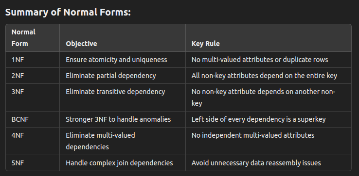

## normal forms (NF)

### 1st Normal Form (1NF)
Rules:
- Each column must contain only atomic values (no lists or sets).
- Entries in each column must be of the same type.
- Each row should be unique (no duplicate rows).
- Order of data does not matter.

### 2nd Normal Form (2NF)
Rules:
- Must be in 1NF.
- Every non-prime attribute must depend on the whole primary key (not just part of it).

### 3rd Normal Form (3NF)
Rules:
- Must be in 2NF.
- No transitive dependency between non-prime attributes.

### Boyce-Codd Normal Form
Rules : 
- Must be in 3NF 
- For every functional dependency (X → Y), X must be a superkey.

### 4th Normal Form 
Rules:
- Must be in BCNF.
- No multi-valued dependencies.

